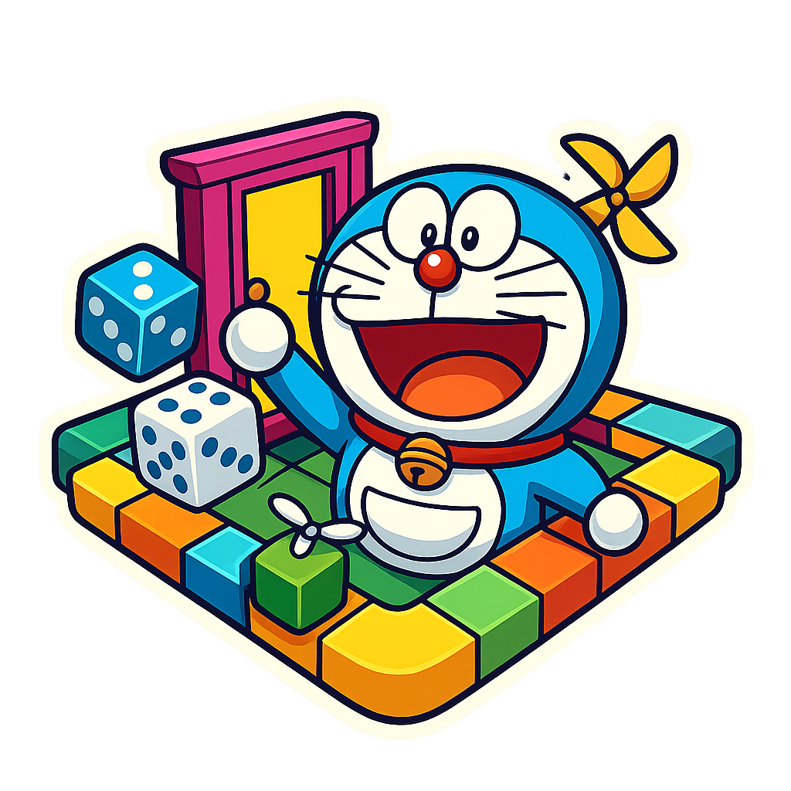

# Doraemon Dice Dimension: The Great Gadget Heist

<div align="center">

**Doraemon Dice Dimension is a wildly unpredictable reimagining of the classic board game _Snakes and Ladders_. Inspired by the beloved anime _Doraemon_ , this game introduces time-warping gadgets, dual-dice chaos, and strategic unpredictability into a nostalgic childhood favorite.**

<p align="center">
  
</p>

</div>


> **A wildly unpredictable reimagining of the classic Snakes and Ladders, powered by Doraemon's time-warping gadgets!**

## Story

The evil **Alien Techno-Thief** has infiltrated Doraemon's dimension and stolen his legendary **4D pocket**, scattering many powerful gadgets across a temporal battlefield spanning 100 dangerous squares.

Your mission: Navigate through time rifts and dimensional portals, collecting gadgets and outsmarting opponents to reach **Square 100** where Doraemon awaits rescue. But beware—you have only **60 minutes** before Doraemon is lost forever!

## Features

### 🎲 Dual-Dice Chaos System

- **Positive Die (+)**: Propels you forward through time
- **Negative Die (-)**: Pulls you backward into the past
- **Net Result**: Strategic unpredictability in every roll
- **Tactical Skip**: Choose to skip forward movement (but never backward!)

### Time-Warping Board Elements

- **Anywhere Door**: Dimensional portals that teleport you forward + **1 Gadget Point**
- **Time Machine Rift**: Temporal anomalies forcing backward displacement

### Unique Character Abilities

| Character    | Class                | Special Ability                                      |
| ------------ | -------------------- | ---------------------------------------------------- |
| **Nobita**   | Bad Luck Survivor    | Random start (1-10) + 1 Gadget Point bonus           |
| **Shizuka**  | Tactical Coordinator | Teleport any ahead player to her position (3x/game)  |
| **Gian**     | Berserker            | Rage Mode: +2 squares next turn after hitting a Rift |
| **Suneo**    | Strategic Investor   | Nullify ONE Door/Rift effect (1x/game)               |
| **Dekisugi** | Mathematical Genius  | Invert dice result (×-1) unlimited times             |

### Victory Conditions

- **Primary Goal**: Reach Square 100
- **Winner**: Player with the **MOST Gadget Points**
- **Time Limit**: 60 minutes or mission fails
- **Teamwork**: All players must reach the goal to rescue Doraemon

## Game Modes

- **Player vs Computer**: Test your skills against AI opponents
- **Player vs Player**: Compete with friends locally
- **Minimum Players**: 2 (any combination of Player/Computer)

## Tech Stack

- **Framework**: [Next.js 14](https://nextjs.org/)
- **Styling**: [Tailwind CSS](https://tailwindcss.com/)
- **Icons**: [Lucide React](https://lucide.dev/)
- **Language**: JavaScript/React
- **Type**: Frontend-only game

## Getting Started

### Prerequisites

- Node.js 18+
- npm or yarn

### Installation

1. **Clone the repository**

```bash
git clone https://github.com/Abhisek-Dash-Official/doraemon-dice-dimension.git
cd doraemon-dice-dimension
```

2. **Install dependencies**

```bash
npm install
# or
yarn install
```

3. **Run the development server**

```bash
npm run dev
# or
yarn dev
```

4. **Open your browser**
   Navigate to [http://localhost:3000](http://localhost:3000)

### Build for Production

```bash
npm run build
npm start
```

## How to Play

1. **Character Selection**: Choose your operative from 5 unique characters
2. **Mode Selection**: Select Player vs Computer or Player vs Player
3. **Start Mission**: Hit "START MISSION" to begin the 60-minute countdown
4. **Roll Dice**: Click "ROLL DICE" each turn to determine movement
5. **Collect Gadgets**: Land on Anywhere Doors for bonus points
6. **Use Abilities**: Deploy character powers strategically
7. **Reach Square 100**: First to arrive with most Gadget Points wins!

## Project Structure

```
doraemon-dice-dimension/
├── app/
│   ├── page.js           # Main game board
│   ├── logic/            # Main game Logic
│   ├── help/
│   │   └── page.js       # Game guide/help page
│   ├── layout.js         # Root layout
│   ├── globals.css       # Global styles
│   ├── components/       # UI components
│   ├── data/             # Game configuration data
│   └── DesktopOnlyWrapper.js
├── public/
│   └── logo.png          # Game logo
│   └── win.png           # Win Image
│   └── loose.png         # Loose Image
├── package.json
└── README.md
```

## Design Philosophy

- **Dark Gaming Aesthetic**: Immersive cyberpunk-inspired UI
- **Glassmorphism Effects**: Modern backdrop blur and transparency
- **Responsive Design**: Optimized for desktop gameplay (1024px+)
- **Professional Gaming Vocabulary**: Mission-critical terminology
- **Smooth Animations**: Polished transitions and hover effects

## Game Mechanics Deep Dive

### Dice Calculation Example

```
Positive Die: +6
Negative Die: -3
Net Movement: 6 - 3 = 3 squares FORWARD
```

### Movement Protocol

- **Positive Result**: Optional movement (can skip strategically)
- **Negative Result**: Mandatory backward movement (no escape!)

### Gadget Point System

- Start: 0 points (except Nobita: 1 point)
- Anywhere Door: +1 point bonos
- Victory: Highest points at Square 100 wins

## Contributing

Contributions are welcome! Please feel free to submit a Pull Request.

1. Fork the project
2. Create your feature branch (`git checkout -b feature/AmazingFeature`)
3. Commit your changes (`git commit -m 'Add some AmazingFeature'`)
4. Push to the branch (`git push origin feature/AmazingFeature`)
5. Open a Pull Request

## License

This project is for educational purposes only.
Created as a learning project - not intended for commercial use.

## Acknowledgments

- Inspired by **Doraemon** anime series by Fujiko F. Fujio
- Classic **Snakes and Ladders** board game
- Built with ❤️ for Doraemon fans worldwide

## Contact

- **GitHub**: [@Abhisek-Dash-Official](https://github.com/Abhisek-Dash-Official)
- **Email**: im.abhisekdash.9753@gmail.com

---

<div align="center">

**Ready to rescue Doraemon? The temporal battlefield awaits!**

Made with 💙 by the Doraemon Dice Dimension Team

</div>
